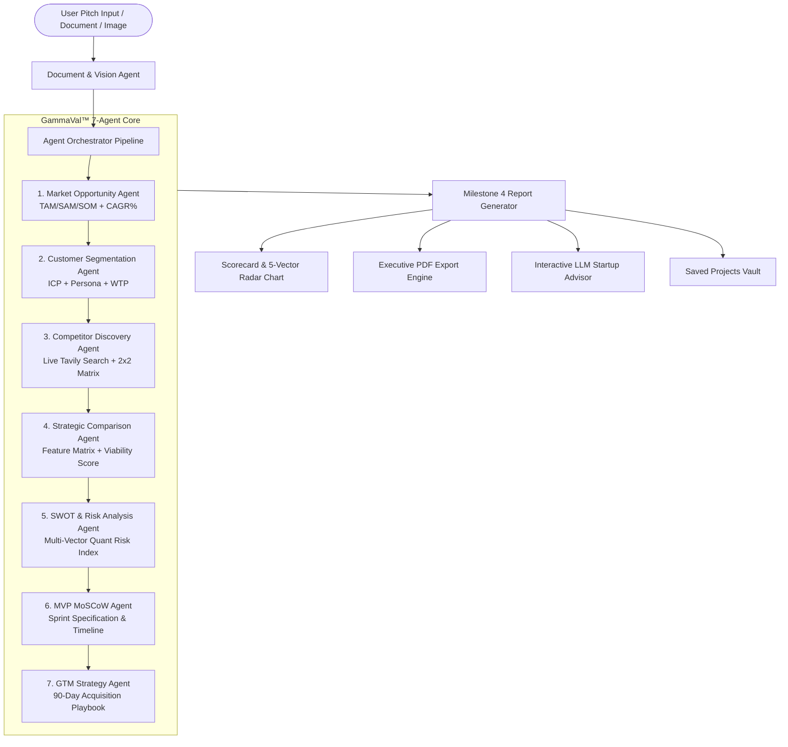

# 🛠️ TECHNICAL DOCUMENTATION — GAMMAVAL™ AI

## 1. System Architecture Overview

GammaVal™ AI is an autonomous, multi-agent due diligence and startup validation engine designed to evaluate business ideas, compute addressable market sizing (TAM/SAM/SOM), perform live web competitive intelligence via Tavily, model SWOT & quantified risk metrics, formulate MoSCoW MVP blueprints, and generate actionable 90-day Go-to-Market (GTM) execution roadmaps.

---

## 2. Multi-Agent Pipeline Specifications

### Agent 1: Market Opportunity Agent (`marketOpportunityAgent.js`)
- **Input:** `idea.title`, `idea.domain`, `idea.problem`, `idea.solution`, `idea.region`
- **Output:**
  - `tamVal` (Total Addressable Market in $B)
  - `samVal` (Serviceable Addressable Market in $B)
  - `somVal` (Serviceable Obtainable Market in $M)
  - `cagr` (Compound Annual Growth Rate %)
  - `marketDrivers` (Array of industry tailwinds)
  - `marketStage` (Early / Accelerating / Mature)

### Agent 2: Customer Segmentation Agent (`customerSegmentationAgent.js`)
- **Input:** `idea`, `marketData`
- **Output:**
  - `icpSummary` (Ideal Customer Profile)
  - `painPointSeverity` (Score 1–10)
  - `willingnessToPay` (High / Medium / Low)
  - `estimatedArpu` (Average Revenue Per User)
  - `primaryPersona` ({ role, goals, frustrations })
  - `acquisitionChannels` (Target marketing vectors)

### Agent 3: Competitor Discovery Agent (`competitorDiscoveryAgent.js`)
- **Integration:** Tavily Live Search API (Real-time Google/Web scraping)
- **Output:**
  - `competitors` (Array of 3–5 real direct/indirect competitors, URLs, pricing, and moats)
  - `marketSaturation` (Low / Moderate / High)
  - `positioning2x2` (Market Price vs. Automation Innovation coordinates)

### Agent 4: Strategic Comparison Agent (`comparisonAgent.js`)
- **Output:**
  - `validationScore` (Composite score 0–100)
  - `verdict` (`STRONG GO`, `GO`, `PIVOT`, `NO GO`)
  - `uniqueValueProposition` (Core differentiator)
  - `defensibilityMoat` (Moat strength & explanation)
  - `marketGaps` (Unaddressed wedge opportunity)

### Agent 5: SWOT & Risk Analysis Agent (`swotRiskAgent.js`)
- **Output:**
  - `swot` (4-Quadrant Strengths, Weaknesses, Opportunities, Threats)
  - `riskScores` ({ marketRisk, techRisk, executionRisk, regulatoryRisk, overallRiskIndex })

### Agent 6: MVP MoSCoW Recommendation Agent (`mvpRecommendationAgent.js`)
- **Output:**
  - `moscowFeatures` ({ mustHave, shouldHave, couldHave, wontHave })
  - `recommendedLaunchWeeks` (Sprint build timeline in weeks)
  - `mvpOverview` (Lean MVP scope)

### Agent 7: Go-To-Market Strategy Agent (`gtmStrategyAgent.js`)
- **Output:**
  - `positioningStatement` (Formal Geoffrey Moore positioning framework)
  - `first100CustomersPlaybook` (Zero-to-One customer acquisition)
  - `launchTimeline90Days` (Phased Month 1, 2, 3 execution milestones)

---

## 3. Milestone 4 LLM Chatbot Integration & Memory

- **Model Routing:** OpenRouter API Gateway supporting `google/gemini-2.0-flash-001`, `anthropic/claude-3.5-sonnet`, `openai/gpt-4o`, `deepseek/deepseek-r1`.
- **Conversation Memory:** Preserves multi-turn conversation history by formatting past user questions and advisor responses into context prompts.
- **Fallback Heuristics:** In offline / zero-key mode, utilizes dynamic domain heuristics tailored to the startup idea parameters to deliver structured advice without crashing.

---

## 4. PDF Generation Engine

- Built with `jsPDF`.
- Vector-rendered typography, branded headers, composite viability score badge, TAM/SAM/SOM financial breakdown, SWOT matrix, and 90-day GTM roadmap with automated multi-page pagination.
