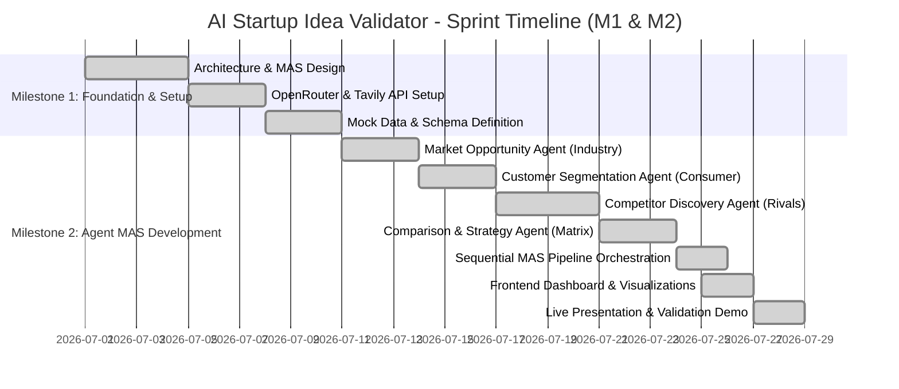

# Agile Project Plan & Milestone Document (M1 & M2)

## Project Title: AI Startup Idea Validator
**Target Timeline**: Milestone 1 & 2 (Week 1–4 | ~20 Hours Total)  
**Team Task Distribution & Division**:
- **Member 1 (Architecture & System Lead)**: Architecture Diagram, Framework Selection & MAS Workflow Justification, API Gateway.
- **Member 2 (Agent Engineer - Market & Customer)**: Market Opportunity Agent & Customer Segmentation Agent development.
- **Member 3 (Agent Engineer - Search & Competition)**: Competitor Discovery Agent (Tavily Integration) & Comparison Agent.
- **Member 4 (Frontend & UX Lead)**: Web Dashboard, Stepper Animations, Visualizations (Recharts), Report Exporter.

---

## Sprint Schedule & Epics

---

## Detailed Task Backlog & User Stories

### Epic 1: Multi-Agent Intelligence Core
- **US-1.1 (Market Opportunity)**: *As an entrepreneur, I want an agent to calculate TAM, SAM, SOM, CAGR, and market drivers so I know the addressable financial opportunity.*
  - **Acceptance Criteria**: Outputs structured financial figures ($ in Billions/Millions), CAGR %, and 3 key industry tailwinds.
- **US-1.2 (Customer Segmentation)**: *As a founder, I want buyer persona cards with pain points and willingness to pay so I know who my primary ICP is.*
  - **Acceptance Criteria**: Identifies 2+ buyer personas, pain severity score (1-10), and estimated willingness-to-pay ($/mo).
- **US-1.3 (Competitor Discovery)**: *As an analyst, I want real web competitor findings using Tavily Search so I am aware of existing direct and indirect rivals.*
  - **Acceptance Criteria**: Connects to Tavily API, queries live web data, returns competitor name, live link, features, and pricing.
- **US-1.4 (Comparison & Strategy)**: *As a venture strategist, I want a feature parity table and overall 0-100 Validation Score with Go/No-Go verdict.*
  - **Acceptance Criteria**: Produces matrix comparing Us vs Rival A vs Rival B, calculates overall validation score (0-100), and outputs strategic verdict.

### Epic 2: Orchestration & Data Flow
- **US-2.1 (Sequential MAS Pipeline)**: *As a developer, I want context passed seamlessly from Market -> Customer -> Competitors -> Comparison without data loss.*
  - **Acceptance Criteria**: Orchestrator executes agents sequentially, passing accumulated state object to each subsequent agent.
- **US-2.2 (API Key Flexibility)**: *As a reviewer, I want to use OpenRouter and Tavily keys or use built-in demo mode without keys.*
  - **Acceptance Criteria**: System detects active keys; if absent, transparently falls back to domain-aware live demo generators.

### Epic 3: User Interface & Visualization
- **US-3.1 (Interactive Dashboard)**: *As a user, I want an elegant dark-theme glassmorphism UI with live execution progress and interactive charts.*
  - **Acceptance Criteria**: Recharts TAM/SAM/SOM charts, Validation Score Gauge, SWOT radar, and feature matrix.
- **US-3.2 (Report Exporter)**: *As a founder, I want to download the entire validation audit in Markdown or JSON.*
  - **Acceptance Criteria**: 1-click Markdown download containing executive summary, market data, competitors, and strategy.

---

## Live Presentation Demo Script (July 27th-28th)

1. **Introduction (1 Min)**: Present problem statement: 90% of startups fail due to lack of market need. Introduce the AI Startup Idea Validator MAS solution.
2. **Architecture & Framework Justification (2 Mins)**: Display Architecture Diagram (Mermaid). Explain framework choice (Lightweight Async MAS Pipeline with OpenRouter & Tavily API over heavy frameworks).
3. **Live Execution Demo (4 Mins)**:
   - Select Preset Idea: *"AI Legal Document Auditor for Small Law Firms"*.
   - Trigger MAS Pipeline execution.
   - Show live agent step progress: Market Opp Agent $\rightarrow$ Customer Agent $\rightarrow$ Competitor Agent (Tavily Live Web Search) $\rightarrow$ Comparison Agent.
   - Inspect generated Visualizations: TAM/SAM/SOM Bar Chart, Buyer Persona Cards, Live Competitor Links, Us vs Competition Feature Matrix, Validation Scorecard (86/100 - Verdict: Proceed with Caution / Niche Focus).
4. **Export & Q&A (1 Min)**: Export report as Markdown file. Open floor for questions.
