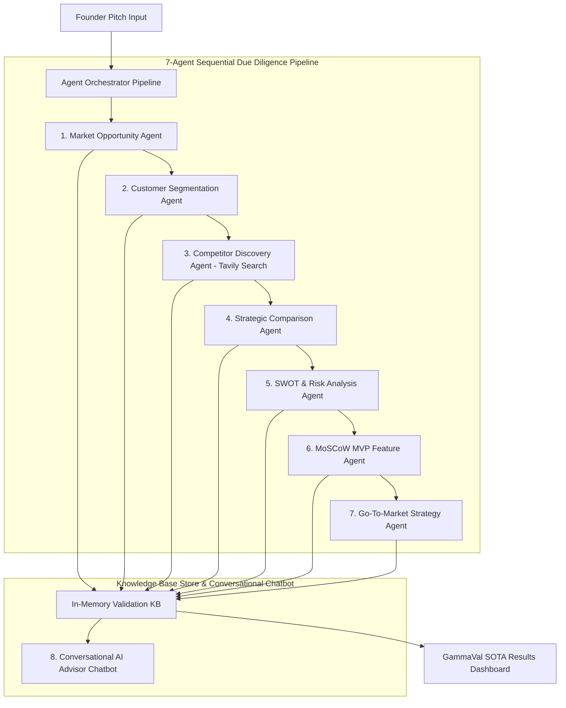

# System Architecture Specification - GammaVal™ AI

## Overview
GammaVal™ AI is an enterprise-grade Multi-Agent System (MAS) platform engineered to perform automated venture capital due diligence on startup concepts.

## System Components
1. **Multi-Model LLM Gateway (`openRouterClient.js`)**: Routes requests across Gemini 2.0 Flash, Claude 3.5 Sonnet, GPT-4o, and Llama 3.3.
2. **Tavily Live Web Search Adapter (`tavilyClient.js`)**: Fetches real-time web search results for direct competitor discovery, pricing, and feature comparison.
3. **Agent Orchestrator Engine (`agentOrchestrator.js`)**: Manages sequential step transitions, emits telemetry log streams, and builds the unified Knowledge Base.
