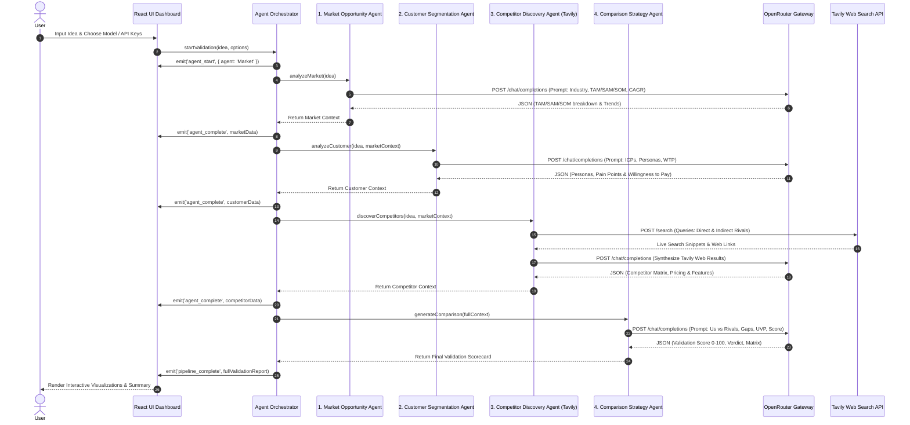

# Framework Selection, MAS Workflow & Justification

## 1. Multi-Agent Framework Selection & Comparison

When designing the AI Startup Idea Validator, we evaluated three primary architectural frameworks for multi-agent coordination:

| Feature / Criteria | CrewAI | LangGraph / LangChain | Custom Async MAS Pipeline (Chosen) |
| :--- | :--- | :--- | :--- |
| **Execution Control** | Dynamic / Autonomous | Graph-based State Machine | Deterministic Async Context Pipeline |
| **API Overhead** | High (Heavy dependencies) | High (LangChain abstractions) | Zero (Pure JavaScript / REST APIs) |
| **Live Web Search Integration** | Requires custom tools wrapper | Requires custom tools wrapper | Direct Tavily API Search integration |
| **Multi-LLM Gateway** | Limited provider abstractions | Provider wrappers | Native OpenRouter API (Access to 100+ LLMs) |
| **Browser / Client Compatibility** | Server-only (Python) | Server-heavy (Python/JS) | 100% Web & Server Compatible |
| **UI Streaming & Event Hooks** | Complex callback hooks | Graph state streams | Native Event Listener / Stream Callback |

---

## 2. Rationale & Justification for Custom Async Pipeline

### Why Not Heavy Frameworks (CrewAI / AutoGen / LangChain)?
1. **Deterministic Execution**: Startup idea validation requires a strict logical sequence:
   $$\text{Market Opportunity} \rightarrow \text{Customer ICP} \rightarrow \text{Competitor Web Search} \rightarrow \text{Competitive Strategy Matrix} \rightarrow \text{Final Scorecard}$$
   Autonomous agents with open-ended looping often hallucinate redundant search calls, ballooning API costs and execution time.
2. **OpenRouter Flexibility**: OpenRouter provides unified access to top-tier LLMs (Gemini 2.0 Flash, Claude 3.5 Sonnet, GPT-4o-mini, Llama 3.3 70B). A direct lightweight REST adapter eliminates third-party SDK breaking changes and allows model swapping on a per-agent basis.
3. **Live Competitor Discovery with Tavily**: Real-time competitor discovery requires up-to-date web access. Integrating Tavily directly enables search query formulation by the Competitor Agent, parsing real domain URLs, features, and pricing snippet data.
4. **Rich UI Interactivity**: A web dashboard requires real-time progress steps, step logs, live confidence metrics, and instant error recovery—which light-weight custom event handlers deliver seamlessly.

---

## 3. Detailed MAS Workflow

---

## 4. OpenRouter & Tavily Integration Specifications

- **OpenRouter API Endpoint**: `https://openrouter.ai/api/v1/chat/completions`
  - Default Model: `google/gemini-2.0-flash-001` (Fast, high reasoning capacity, cost-effective).
  - Alternative Models: `anthropic/claude-3.5-sonnet`, `openai/gpt-4o-mini`, `meta-llama/llama-3.3-70b-instruct`.
  - JSON Mode Enforcement: Enforces strict structured output parsing using JSON schema instructions in system prompts.

- **Tavily Search API Endpoint**: `https://api.tavily.com/search`
  - Deep Search Depth: `advanced`
  - Result Count: Top 5 relevant live web domain hits per competitor search query.
  - Snippet Synthesis: Extracts competitor product descriptions, pricing tiers, and market offerings directly from live web search results.
